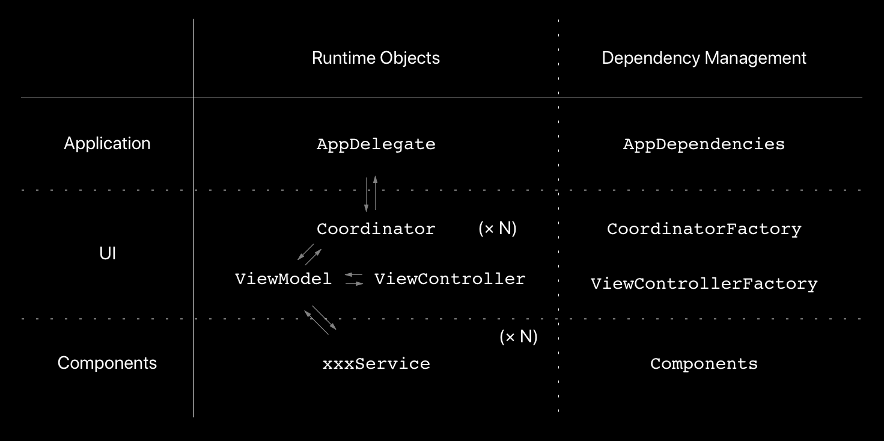

# JSONPlaceholderViewer
Demo project

## Requirements
This project is using these tools in Run Scripts.
Using different version of these tools might cause compile errors.
Please remove RunScripts if it is impossible to change the version of the tools.

- SwiftLint v0.26.0
- SwiftGen v5.3.0

## Installation

```
carthage bootstrap --platform iOS
```

## Architecture
- MVVM-C based
- Manual DI
  - All depended objects are injected from outside in dependency management objects

    


## Reference
### About this architecture
- [App Architecture By Manual DI - Yoshikuni Kato - Tokyo iOS Meetup : July 21, 2018 (video)](https://www.youtube.com/watch?v=Z3tiYtq5oio)
- [App Architecture By Manual DI
 (slides)](https://speakerdeck.com/yoching/app-architecture-by-manual-di-1)
